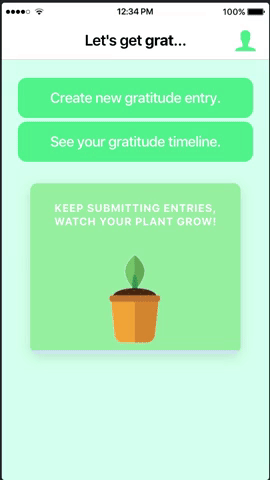

# gratitude_app

Description: Native progresive web app designed to mimic the peer-reviewed benefit of this Harvard study: 
  https://www.health.harvard.edu/newsletter_article/in-praise-of-gratitude

### Functionality: 
- Cloud-based user Authentication + Profile Management
- Gratitude Prompts (AI generated) + gratitude timeline.

### Front-End: 
- Ionic v4 + Capacitor (https://capacitor.ionicframework.com/docs/getting-started/with-ionic/)
- Angular

### Back-End:
- AngularFire - https://angular.io/
- Firebase - https://firebase.google.com/
- Naive Bayes classifier - https://scikit-learn.org/stable/modules/generated/sklearn.naive_bayes.MultinomialNB.html

### Local Install:
in /src folder, run "npm install"
run "ionic lab" 

Login Screen: | Timeline Entry: | Timeline View:
------------ | ------------- | -------------
 |  | 

